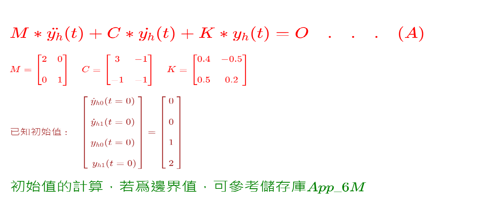
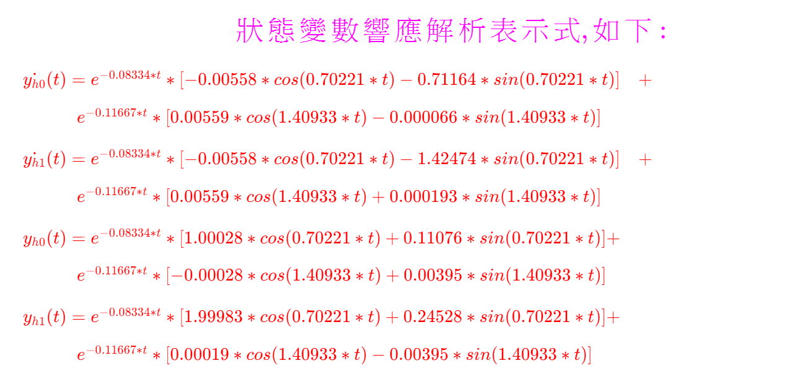
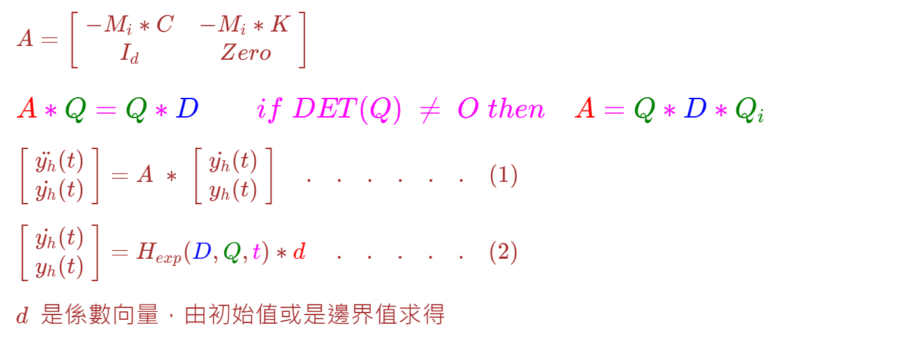
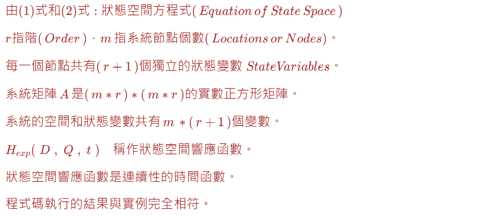

<!--     App_6J  README_6J.md   -->

 
<!--   
# 
# \[ {\color{Fuchsia}精\;銳\;矩\;陣\;計\;算\;求\;解\;器} \]  
## \[ {\color{Green} 【Sharp \; Matrix \; Solver \quad\; S\; M\; S】 } \] 
-->  

<!--   
#  
##### \[ {\color{Brown}  Jagmohan \quad L. \quad Humar} \]
##### \[ {\color{Brown} Dynamics \quad of \quad Structures \quad (Third \quad Edition) } \]  
##### \[ {\color{Brown} 第\;505\;頁\quad 至 \quad第\;505\;頁 } \]  
## 測試實例採用 : Jagmohan L. Humar, "Dynamics of Structures Third Editon"  
### Example 10.3 第502頁 至 504頁，作爲SMS實作驗證  
-->  

  
<!--    
## \( {\color{Red} M \ast \ddot{y_h}(t) + C \ast \dot{y_h}(t) + K \ast y_h(t) = d_h \quad . \quad . \quad . \quad (A) } \)  
####  
##### \( {\color{Red} M = [2 \quad 0] \; | \; [0 \quad 1], \quad C = [3 \quad -1] \; | \; [-1 \quad 1], \quad K = [0.4 \quad -0.5] \; | \; [0.5 \quad 0.2], \quad 即 \; ： } \)  
####  
###### \( { \color{Green}d_h 是係數向量，由初始值或是邊界值的決定 :} \)  
###### \( { \color{Green} 本實例為初始值的計算，若爲為邊界值的計算，可參考儲存庫App \_ 6M}\)
-->

###

  
<!--   
###  \[ { \color{fuchsia} 狀\,態\,變\,數\,響\,應\,解\,析\,表\,示\,式,如\,下 : } \] 
#####  
###### \( { \color{red} \dot{y_{h0}}(t) = e^{-0.08334 \ast t} \ast [ -0.00558 \ast cos( 0.70221 \ast t) - 0.71164 \ast sin(0.70221 \ast t)] \quad + } \)
###### \( { \color{red} \qquad \quad e^{-0.11667 \ast t} \ast [ 0.00559 \ast cos( 1.40933 \ast t) - 0.000066 \ast sin(1.40933 \ast t)] } \)
####  

###### \( { \color{red} \dot{y_{h1}}(t) = e^{-0.08334 \ast t} \ast [ -0.00558 \ast cos( 0.70221 \ast t) - 1.42474 \ast sin(0.70221 \ast t)] \quad + } \) 
##### \( { \color{red} \qquad \quad e^{-0.11667 \ast t} \ast [ 0.00559 \ast cos( 1.40933 \ast t) + 0.000193 \ast sin(1.40933 \ast t)] } \)
####    
###### \( { \color{red} y_{h0}(t) = e^{-0.08334 \ast t} \ast [ 1.00028 \ast cos( 0.70221 \ast t) + 0.11076 \ast sin(0.70221 \ast t)] + } \) 
###### \( { \color{red} \qquad \quad e^{-0.11667 \ast t} \ast [ -0.00028 \ast cos( 1.40933 \ast t) + 0.00395 \ast sin(1.40933 \ast t)]  } \)
####  
###### \( { \color{red} y_{h1}(t) = e^{-0.08334 \ast t} \ast [ 1.99983 \ast cos( 0.70221 \ast t) + 0.24528 \ast sin(0.70221 \ast t)] +  } \) 
###### \( { \color{red} \qquad \quad e^{-0.11667 \ast t} \ast [ 0.00019 \ast cos( 1.40933 \ast t) - 0.00395 \ast sin(1.40933 \ast t)] } \)
####
-->  

---  

  
<!--  
#### \( {\color{Brown} { A \quad 是系統【狀態】矩陣， 為正方形非對稱實數矩陣。}  } \)
#### \( { \color{brown} { D \quad 是複數特徵值矩陣。 } } \)  
#### \( {  \color{brown} { Q \quad 是複數特徵值矩陣。 } } \)
-->  

---  

  
<!--    
#### \( { \color{Brown}  { A = \begin{bmatrix} \; -M_i \ast C & -M_i \ast K \; \\ \; I_m & O_m \; \end{bmatrix}  }  }  \)
### \({  { \color{Fuchsia}  {\color{Red} A }  \ast  {\color{Green} Q } = { \color{Green} Q } \ast  { \color{Blue} D }  \qquad if \; DET(Q) \; \not= \; O \; then \quad { \color{Red} A } = { \color{Green} Q } \ast { \color{Blue} D } \ast  { \color{Green} Q_i }  }  }\)
#####
#### \( {  \color{Brown} { \begin{bmatrix} \; \ddot{y_h}(t) \; \\ \; \dot{y_h}(t) \; \end{bmatrix}  =  A \; \ast \; \begin{bmatrix} \; \dot{y_h}(t) \; \\ \; y_h(t) \; \end{bmatrix} \quad . \quad . \quad . \quad . \quad . \quad . \quad (1)   }  } \)
#####
#### \( { \color{brown} { \begin{bmatrix} \; \dot{y_h}(t) \; \\ \; y_h(t) \; \end{bmatrix}  =  H_{exp}( {\color{Blue} D}, {\color{Green} Q}, {\color{Fuchsia}t} ) \ast {\color{Red} d} \; \quad . \quad . \quad . \quad . \quad . \quad (2)  } }\)
-->

---  

  
<!--      
#### \({  \color{Brown} 由(1)式和(2)式，可求得狀態變數響應值(\, Response \, of \, State \, Variables\, )   }\)
#### \({  \color{Brown} 共有(\,r + 1\,)個狀態，每一個狀態有\,m\,個變數。   }\)  
#### \({  \color{Brown} r指階(\,Order\,)，m \, 指位置(\,Locations\,)個數。    }\)  
#### \({  \color{Brown} 系統矩陣\, A \, 是(\,m \ast r\,) \ast (\,m \ast r\,)的實數正方形矩陣。    }\)  
#### \({  \color{Brown} 狀態變數共有\,m\, \ast (\,r + 1\,)個變數。   }\)  
#### \({  {\color{Brown} H_{exp}(\;D\; , \; Q \; , \; t \;)} \quad  {\color{Brown} 稱作狀態變數響應函數。 }    }\)
#### \({  \color{Brown} 係由本人推導公式再以C\#程式撰寫而成，是精確連續性的時間函數。    }\)
#### \({  \color{Brown}  上述的解析表示式，與程式碼執行的結果，完全相同。   }\)  
##  
-->

---  

  

--- 

> "+"，"-"，"*"，"/"表示陣列的加、減、乘和除的運算子，
> 
> "=="和"!="表示陣列相等否？，傳回bool值，
> 
> "&"表示陣列的水平合併，"|"表示陣列的垂直合併，"^"向量内積，
> 
> "~"方陣求逆，"!"陣列轉置，"+"單位向量，等等的運算子，共計有十二個。
> 
> 上述的陣列運算子，適用於複數和實數陣列運算。複數與實數的轉換稱作Implicit and Explicit Type Converter。
> 

### 

--- 
> 請參考本儲存庫，【程式輸出與解析法數據比較.pdf】的檔案，其中表格二(上層為Humar解析
> 
> 式輸出結果，下層為C#程式碼計算結果)，兩者數值完全相同。本例 m = 2 , r = 2 故狀態矩陣 A 
>
> 是 m X r = 4 ， 即4乘4的實數非對稱的矩陣。但特徵值和對應的特徵向量均爲複數。
>
> 相關的C#程式碼和輸出結果，可參見【ConsoleApp6J.pdf】檔案。
>
> 另相關的視覺化圖表，可參見Python程式碼和PDF檔案。
>
---  

  

##  
##  
